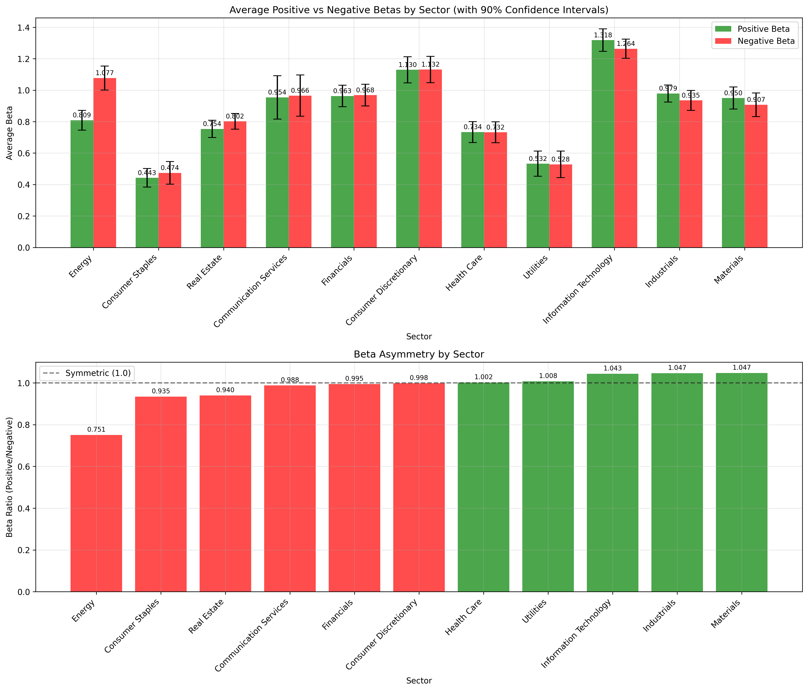

# Nonlinear Beta Analysis: Challenging CAPM Assumptions

This repository implements a comprehensive analysis of nonlinear beta relationships in stock returns, challenging the traditional CAPM assumption that stocks have constant sensitivity to market movements regardless of market direction.

## Research Question

**Do stocks behave differently in positive vs negative market environments?**

Traditional CAPM assumes that a stock's beta (sensitivity to market movements) is constant. This analysis tests whether stocks exhibit asymmetric behavior - potentially having different betas in up markets vs down markets.

## Key Findings

### S&P 500 Comprehensive Analysis (2021-2025)
- **Sample Size**: 502 S&P 500 companies (excluding outlier K), 1,139 trading days
- **Positive Market Days**: 620 (54.4%)
- **Negative Market Days**: 517 (45.6%)
- **Mean Beta Ratio**: 1.002 (very close to 1.0, suggesting overall symmetry)
- **Median Beta Ratio**: 0.994
- **Standard Deviation**: 0.250

### Most Asymmetric Stocks (Beta Ratio > 1.5)
1. **MKTX (MarketAxess)**: 1.916 ratio - Financials
2. **ED (Consolidated Edison)**: 1.915 ratio - Utilities  
3. **ERIE (Erie Indemnity)**: 1.717 ratio - Financials
4. **LMT (Lockheed Martin)**: 1.590 ratio - Industrials
5. **MOH (Molina Healthcare)**: 1.559 ratio - Health Care

### Sector Analysis Results
**Sectors Ranked by Beta Ratio (Positive/Negative):**
1. **Industrials**: 1.079 (highest positive bias)
2. **Materials**: 1.047
3. **Information Technology**: 1.043
4. **Health Care**: 1.002 (most symmetric)
5. **Utilities**: 1.008
6. **Consumer Discretionary**: 0.998
7. **Financials**: 0.995
8. **Communication Services**: 0.988
9. **Real Estate**: 0.940
10. **Consumer Staples**: 0.945
11. **Energy**: 0.751 (highest negative bias)

**Key Sector Insights:**
- **Energy** shows the most dramatic asymmetry (0.751 ratio) - energy stocks have much higher negative betas
- **Industrials** shows the highest ratio (1.079) indicating higher positive betas relative to negative betas
- **Health Care** is the most symmetric sector (1.002 ratio)
- **Consumer Staples** and **Energy** both show significant negative bias

## Visualizations

### Sector-by-Sector Analysis
The analysis is split into two comprehensive charts for optimal readability:

1. **`docs/sp500_sector_charts_part1.png`** - First 6 sectors with improved readability
2. **`docs/sp500_sector_charts_part2.png`** - Remaining 5 sectors with enhanced spacing


**Features:**
- **Gradient Color Scheme**: Red (high positive bias) → Orange → Yellow → Light Blue → Blue (high negative bias)
- **Improved Readability**: Taller charts (30" height) with optimized font sizes
- **Better Spacing**: Especially for sectors with 60+ companies (Information Technology, Financials, Industrials)
- **Value Labels**: Each bar shows the exact beta ratio
- **Reference Line**: Dashed line at 1.0 for symmetry reference

### Sector Comparison Chart
**`docs/sector_beta_comparison.png`** - Comprehensive sector analysis showing:
- Average positive vs negative betas by sector
- Beta ratio comparison across all sectors
- Consistent gradient color scheme
- Clear visual identification of asymmetric sectors



## Technical Implementation

### Data Sources
- **S&P 500 Companies**: Official list scraped from Wikipedia with GICS sector classification
- **Market Data**: SPY (S&P 500 ETF) as market proxy via Alpaca Markets API
- **Time Period**: 2021-2025 (1,139 trading days)
- **Rate Limiting**: Optimized to respect 200 calls/minute API limit

### Beta Calculation Method
**Traditional Beta**: Standard regression of stock returns vs market returns
**Positive Beta**: Regression using only days when market return > 0
**Negative Beta**: Regression using only days when market return < 0
**Beta Ratio**: Positive Beta / Negative Beta

### Key Scripts
- **`sp500_optimized_analysis.py`**: Main analysis script with rate limiting and progress tracking
- **`sp500_wikipedia_scraper.py`**: Scrapes official S&P 500 list from Wikipedia
- **`regenerate_charts_only.py`**: Regenerates visualizations with improved readability

## Installation & Usage

```bash
# Clone repository
git clone <repository-url>
cd asymmetric-beta

# Install dependencies
pip install -r requirements.txt

# Run Wikipedia scraper to get S&P 500 data
python sp500_wikipedia_scraper.py

# Run comprehensive analysis
python sp500_optimized_analysis.py

# Regenerate charts with improved readability
python regenerate_charts_only.py
```

## Research Implications

### Portfolio Construction
- **Defensive Sectors**: Energy and Consumer Staples may provide better downside protection
- **Momentum Sectors**: Industrials and Information Technology may offer better upside capture
- **Symmetric Sectors**: Health Care provides balanced exposure to market movements

### Risk Management
- **Asymmetric Beta Awareness**: Traditional beta may underestimate risk in certain market conditions
- **Sector Diversification**: Consider beta asymmetry when constructing sector allocations
- **Dynamic Hedging**: Energy stocks may be effective hedges during market downturns

### Market Efficiency
- **Behavioral Factors**: Asymmetric betas may reflect investor behavior differences in up vs down markets
- **Sector Characteristics**: Different sectors exhibit distinct asymmetric patterns
- **CAPM Limitations**: Traditional CAPM may not capture the full complexity of market relationships

## Future Research Directions

1. **Time-Varying Analysis**: Examine how beta asymmetry changes over different market cycles
2. **Cross-Asset Analysis**: Extend analysis to bonds, commodities, and international markets
3. **Factor Integration**: Combine with other factors (size, value, momentum) for enhanced models
4. **Machine Learning**: Use ML techniques to predict beta asymmetry patterns
5. **Trading Strategies**: Develop strategies that exploit beta asymmetry for alpha generation

## Contributing

Contributions are welcome! Please feel free to submit issues, feature requests, or pull requests.

## License

This project is licensed under the MIT License - see the LICENSE file for details.
